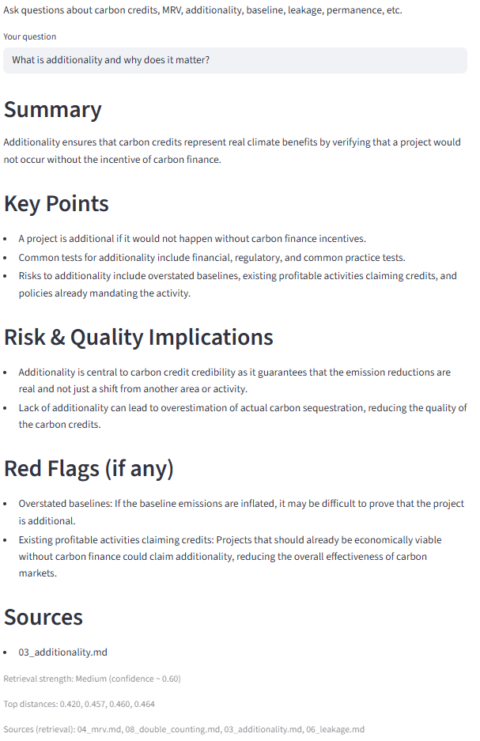

# Carbon Credit Assistant

## Author
Juliana Neiva

## Overview
A fully local Retrieval-Augmented Generation (RAG) assistant for carbon credit knowledge and risk analysis.

This project demonstrates how to build an end-to-end AI application using:

- Large Language Models (LLM)
- Vector databases (Chroma)
- Embeddings and semantic search
- Retrieval-Augmented Generation (RAG)
- Prompt engineering for domain-specific analysis

The assistant answers questions about carbon credits using documents and provides structured risk-oriented responses similar to a carbon credit analyst.

---

## Features

- Semantic search over carbon credit documents  
- Grounded LLM responses using retrieved context  
- Retrieval strength detection (confidence heuristic)  
- Local vector database (Chroma)  
- Fully offline (Ollama local models)  
- Streamlit interactive interface  
- Structured analyst-style answers  

---

## Architecture

1. Documents → Chunking → Embeddings (Ollama) → Chroma Vector DB
2. User Question → Embedding → Similarity Search → Context
3. LLM (Ollama)
4. Structured Answer + Sources + Confidence

---

## Example Questions

- What is additionality and why does it matter?
- Explain MRV and its importance in carbon credits.
- What are common carbon credit quality red flags?
- How does permanence risk affect nature-based credits?
- What is leakage and how can it be mitigated?

---

## Demo UI

---

## Tech Stack

- Python
- ChromaDB (vector database)
- Ollama (local LLM + embeddings)
- Streamlit (UI)
- RAG architecture

---

## Setup

### 1. Install Ollama

Download: https://ollama.com

Start Ollama (it must be running in background).

### 2. Pull models

ollama pull nomic-embed-text

ollama pull mistral:7b

### 3. Install dependencies

pip install -r requirements.txt

### 4. Add documents

Place `.md` or `.txt` files in: data/docs/

### 5. Build vector index

python app/ingest.py --reset

### 6. Run app

streamlit run app/streamlit_app.py

---

## RAG Pipeline

1. Documents are chunked and embedded locally
2. Embeddings stored in Chroma vector database
3. User question embedded
4. Top-k semantic search
5. Retrieved context sent to LLM
6. Structured grounded answer generated

---